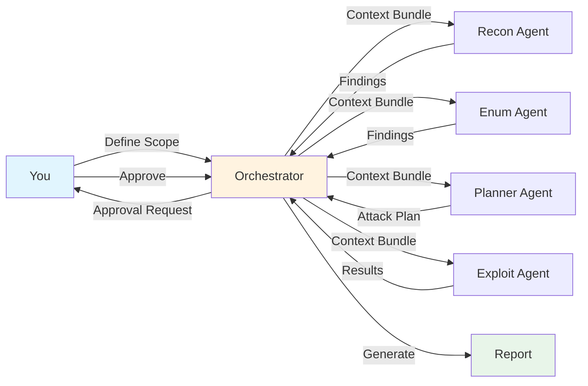

<div align="center">

```
 ██╗   ██╗██╗██████╗ ███████╗    ██╗  ██╗ █████╗  ██████╗██╗  ██╗     █████╗ ██╗
 ██║   ██║██║██╔══██╗██╔════╝    ██║  ██║██╔══██╗██╔════╝██║ ██╔╝    ██╔══██╗██║
 ██║   ██║██║██████╔╝█████╗      ███████║███████║██║     █████╔╝     ███████║██║
 ╚██╗ ██╔╝██║██╔══██╗██╔══╝      ██╔══██║██╔══██║██║     ██╔═██╗     ██╔══██║██║
  ╚████╔╝ ██║██████╔╝███████╗    ██║  ██║██║  ██║╚██████╗██║  ██╗    ██║  ██║██║
   ╚═══╝  ╚═╝╚═════╝ ╚══════╝    ╚═╝  ╚═╝╚═╝  ╚═╝ ╚═════╝╚═╝  ╚═╝    ╚═╝  ╚═╝╚═╝
```

# The Future of Penetration Testing is Here.

### AI-Powered Multi-Agent System with Human-in-the-Loop Safety

[](https://www.python.org/downloads/)
[](LICENSE)
[](tests/)
[](https://modelcontextprotocol.io/)
[](CONTRIBUTING.md)

<br>

**VibeHackAI** orchestrates 4 specialized AI agents that think like expert pentesters,<br>
while keeping **you** in control of every critical decision.

[Getting Started](#-quick-start) •
[Features](#-why-vibehackai) •
[Documentation](docs/) •
[Contributing](CONTRIBUTING.md)

<br>

---

</div>

## The Problem

Traditional penetration testing tools are either:
- **Too manual** — You spend hours configuring and running individual tools
- **Too automated** — Black-box scanners that miss context and generate false positives
- **Too dangerous** — Fully autonomous systems that can cause unintended damage

**Security professionals deserve better.**

## The Solution

VibeHackAI brings the power of **collaborative AI agents** to penetration testing — each specialized in a critical phase of the assessment, coordinated by an intelligent orchestrator, and always under your supervision.

<div align="center">

```
    ┌─────────────────────────────────────────────────────────────────┐
    │                        YOU (Human Expert)                        │
    │                              │                                   │
    │                              ▼                                   │
    │     ╔═══════════════════════════════════════════════════════╗   │
    │     ║              🎯 ORCHESTRATOR                          ║   │
    │     ║    Coordination • Approval Gates • Evidence Chain     ║   │
    │     ╚═══════════════════════════════════════════════════════╝   │
    │                              │                                   │
    │        ┌─────────────────────┼─────────────────────┐            │
    │        ▼                     ▼                     ▼            │
    │   ┌─────────┐          ┌─────────┐          ┌─────────┐         │
    │   │  🔍     │          │  🎯     │          │  💥     │         │
    │   │ RECON   │    →     │ ENUM    │    →     │ EXPLOIT │         │
    │   │  Agent  │          │ Agent   │          │  Agent  │         │
    │   └─────────┘          └─────────┘          └─────────┘         │
    │        │                     │                     │            │
    │        └─────────────────────┼─────────────────────┘            │
    │                              ▼                                   │
    │              ╔═════════════════════════════╗                    │
    │              ║  📋 PLANNER Agent           ║                    │
    │              ║  Strategy • CVE • Exploits  ║                    │
    │              ╚═════════════════════════════╝                    │
    │                              │                                   │
    │                              ▼                                   │
    │     ┌─────────────────────────────────────────────────────┐     │
    │     │  🔐 EVIDENCE STORE (Append-Only • SHA256 Verified)  │     │
    │     └─────────────────────────────────────────────────────┘     │
    └─────────────────────────────────────────────────────────────────┘
```

</div>

## ✨ Why VibeHackAI?

<table>
<tr>
<td width="50%">

### 🤖 Multi-Agent Intelligence

Four specialized AI agents work in concert:

- **Reconnaissance Agent** — OSINT, DNS, Shodan, passive intel
- **Enumeration Agent** — Services, endpoints, attack surface
- **Planner Agent** — CVE mapping, exploit selection, strategy
- **Exploitation Agent** — Controlled attacks with approval

Each agent is an expert in its domain.

</td>
<td width="50%">

### 🔌 11+ Tool Integrations

Connects to your favorite security tools via MCP:

```
Nmap        Shodan       OSINT
Burp Suite  Metasploit   Kali Linux
Snyk        CVE-Search   GitHub
GitLab      Filesystem   + more
```

One interface. All your tools.

</td>
</tr>
<tr>
<td width="50%">

### 🛡️ Human-in-the-Loop Safety

You control what matters:

```
[APPROVAL REQUIRED]
━━━━━━━━━━━━━━━━━━━━━━━━━━━━━━━━
Operation: metasploit_exploit
Module:    exploit/multi/http/struts2_rce
Target:    192.168.1.100:8080
Risk:      ████████░░ HIGH

Approve? [y/N]: █
```

No surprises. No accidents. No regrets.

</td>
<td width="50%">

### 📋 Court-Ready Evidence

Every finding is backed by proof:

- **Append-only** evidence storage
- **SHA256** hash verification
- **Complete** audit trails
- **Reproducible** attack chains

From discovery to report, everything is documented.

</td>
</tr>
</table>

## 🚀 Quick Start

### 30-Second Install

```bash
# Clone
git clone https://github.com/cawa102/VibeHackAI.git && cd VibeHackAI

# Install
pip install -e .

# Run
pentest-agent
```

### Your First Scan

```bash
$ pentest-agent

╔══════════════════════════════════════════════════════════════╗
║                    🎯 VibeHackAI v0.1.0                      ║
║           AI-Powered Penetration Testing Assistant            ║
╚══════════════════════════════════════════════════════════════╝

vibehack> start my-first-pentest

[✓] Session created: my-first-pentest
[✓] Evidence store initialized
[✓] Audit logging enabled

vibehack> scope add 192.168.1.0/24

[✓] Target added: 192.168.1.0/24
[!] Scope restricted to authorized targets only

vibehack> run

[▸] Phase: RECONNAISSANCE
[▸] Agent: ReconnaissanceAgent activated
[▸] Running: Shodan lookup...
[▸] Running: DNS enumeration...
[▸] Running: Port discovery...

[✓] 23 hosts discovered
[✓] 147 open ports identified
[✓] 12 potential vulnerabilities flagged

[▸] Evidence saved: evidence/recon-2025-01-21-001/

vibehack> findings

┌─────────────────────────────────────────────────────────────────┐
│ ID       │ Severity │ Title                        │ Evidence   │
├─────────────────────────────────────────────────────────────────┤
│ FIND-001 │ CRITICAL │ Apache Struts2 RCE (S2-045)  │ EV-042     │
│ FIND-002 │ HIGH     │ Redis Unauthenticated Access │ EV-038     │
│ FIND-003 │ HIGH     │ SMB Signing Disabled         │ EV-015     │
│ FIND-004 │ MEDIUM   │ SSL/TLS Weak Ciphers         │ EV-089     │
└─────────────────────────────────────────────────────────────────┘

vibehack> advance   # Move to Exploitation phase...
```

## 🔐 Safety First, Always

VibeHackAI is designed with **defense-in-depth**:

| Layer | Protection |
|-------|------------|
| **Scope Enforcement** | Every operation tagged. Out-of-scope = blocked. |
| **Approval Gates** | Dangerous ops require explicit human approval. |
| **Auto-Stop** | Detects DoS patterns, scope violations, anomalies. |
| **Evidence Chain** | Tamper-proof logs. Every action recorded. |
| **Rollback Ready** | Failed exploits don't leave you stranded. |

```
⚠️  STOP CONDITION TRIGGERED
━━━━━━━━━━━━━━━━━━━━━━━━━━━━
Reason: Consecutive errors detected (scope violation suspected)
Action: All agents halted
Status: Awaiting human review

[!] No operations executed outside approved scope.
```

## 🛠️ Integrations

VibeHackAI leverages **Model Context Protocol (MCP)** to unify your security toolkit:

<div align="center">

| Reconnaissance | Enumeration | Exploitation | Research |
|:-------------:|:-----------:|:------------:|:--------:|
| Shodan | Burp Suite | Metasploit | Snyk |
| Nmap | Nmap | Kali Linux | CVE-Search |
| OSINT | OSINT | — | GitHub |
| WhoisXML | — | — | GitLab |

</div>

> **No more context switching.** VibeHackAI speaks to all your tools.

## 📊 How It Works



**Phase Workflow:**
1. **Reconnaissance** → Gather intel, map attack surface
2. **Enumeration** → Deep dive into services, endpoints
3. **Planning** → CVE matching, exploit selection, strategy
4. **Exploitation** → Controlled attacks with your approval
5. **Reporting** → Evidence-backed findings, ready for delivery

## 📁 Project Structure

```
VibeHackAI/
├── 🤖 src/
│   ├── agents/           # The 4 specialized AI agents
│   ├── orchestrator/     # Coordination & safety systems
│   ├── cli/              # Interactive interface
│   ├── storage/          # State & evidence management
│   ├── mcp_adapters/     # Tool integrations (11+)
│   ├── passer/           # Data normalization
│   └── schemas/          # Type definitions
├── 📚 docs/              # Specifications (source of truth)
├── 🧪 tests/             # 762 tests, all passing
├── 📦 external/          # MCP server implementations
└── 💡 examples/          # Usage examples & tutorials
```

## 📖 Documentation

| Document | Description |
|----------|-------------|
| [INSTALLATION.md](INSTALLATION.md) | Complete setup guide with MCP configuration |
| [examples/](examples/) | Hands-on tutorials and use cases |
| [docs/](docs/) | Technical specifications (9 detailed docs) |
| [CONTRIBUTING.md](CONTRIBUTING.md) | How to contribute |
| [SECURITY.md](SECURITY.md) | Security policy & responsible disclosure |

## 🤝 Contributing

We believe the best security tools are built by the community.

```bash
# Fork, clone, and create your branch
git checkout -b feature/amazing-feature

# Make your changes, test them
pytest

# Submit a PR
```

See [CONTRIBUTING.md](CONTRIBUTING.md) for guidelines.

**Areas we'd love help with:**
- 🔌 New MCP adapters (Nuclei, SQLMap, etc.)
- 🌍 Internationalization
- 📊 Reporting templates
- 🧪 Test coverage
- 📚 Documentation & tutorials

## ⚠️ Legal Disclaimer

<div align="center">

**This tool is for authorized security testing only.**

</div>

- ✅ Use on systems you own or have written permission to test
- ✅ Follow responsible disclosure practices
- ✅ Comply with all applicable laws and regulations
- ❌ Never use for unauthorized access
- ❌ Never use for malicious purposes

**The authors are not responsible for misuse. You are responsible for your actions.**

## 📜 License

MIT License — see [LICENSE](LICENSE) for details.

Free to use, modify, and distribute. Attribution appreciated.

## 🙏 Acknowledgments

- Built on [Model Context Protocol (MCP)](https://modelcontextprotocol.io/) by Anthropic
- Inspired by [PentestGPT](https://github.com/GreyDGL/PentestGPT) and the security research community
- Powered by the incredible open-source security ecosystem

---

<div align="center">

### Ready to transform your penetration testing workflow?

```bash
git clone https://github.com/cawa102/VibeHackAI.git && cd VibeHackAI && pip install -e . && pentest-agent
```

**[⭐ Star this repo](https://github.com/cawa102/VibeHackAI)** if you find it useful!

<br>

Made with 🔐 by security researchers, for security researchers.

<br>

[](https://github.com/cawa102/VibeHackAI/stargazers)
[](https://github.com/cawa102/VibeHackAI/network/members)
[](https://github.com/cawa102/VibeHackAI/watchers)

</div>
